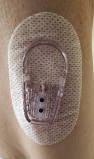
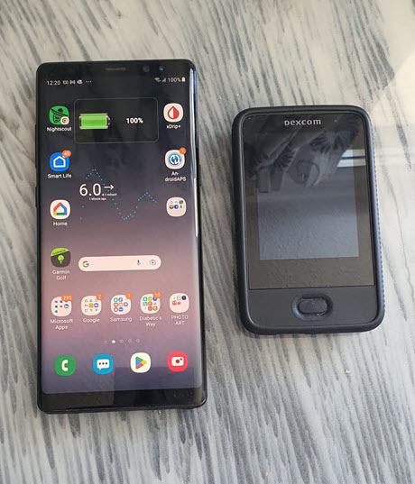

### There are 4 Elements to get started

1. Sensor Applicator
</a>	
2.  Sensor
</a>	
3.  Transmitter
</a>
4.  A Display
</a> 

## Dexcom Intro Userguide

* Prepare for sensor insertion  
* Take off tape **(Do not forget to keep safe or photo your Sensor Code)** you will need this.
* Insert a sensor  
* Attach transmitter to transmitter holder 

<iframe id="video29564" width="860" height="615" src="https://www.youtube.com/embed/1MRU6_GTEtg" frameborder="0" allow="accelerometer; autoplay; encrypted-media; gyroscope; picture-in-picture" allowfullscreen="allowfullscreen">
</iframe>

<!--  
  ******************************************************************************************************************
  mkdocs.yml    # The configuration file.
    docs/
    index.md  # The documentation homepage.
       ...       # Other markdown pages, images and other files.
		
		*************************************************************************
		center text**
		## 
Now Do  
 
		
		*************************************************************
		
********************************************
    Adding exernal link to other a web sites
**********************************************
# 
Part 2: <a href=" https://atlas-night-out.github.io/my-project/user-guide/Setting_up_Heroku_Account_part2/" target="_blank" title="Setting up Heroku Account">Setting up Heroku Account</a> 

 
**********************************************

		
		
		
		
adding 	Yellow Hightligher!!!!!!!!	with bold too
**Marked text**

	

Adding a image with link
 

Adding Video

<iframe width="850" height="415" src="https://www.youtube.com/embed/MFsbm45b6YY" title="YouTube video player" frameborder="0" allow="accelerometer; autoplay; clipboard-write; encrypted-media; gyroscope; picture-in-picture" allowfullscreen></iframe>

Adding an embeded video
<iframe id="video3" width="560" height="315" src="https://www.youtube.com/embed/o7-T2IrDJ_A" title="YouTube video player" frameborder="0" allow="accelerometer; autoplay; clipboard-write; encrypted-media; gyroscope; picture-in-picture" allowfullscreen></iframe>

Note
**Note:** a note is something that needs to be mentioned but is apart from the context.

List
This is a regular paragraph.

Paragraph:

1. **Now Open another tab**  to make a Mongodb Atlas** Account: <a href="https://www.mongodb.com/cloud/atlas" target="_blank" title="Click Start Free">See Here</a> 
  and **click** Start Free
 
   2. Sub item two
   3. Sub item three
2. Item two

font size

link
<a href=" https://github.com/" target="_blank" title="First create a user account by going to">Click Here</a>

Table
| Syntax | Description |
| ----------- | ----------- |
| Header | Title |
| Paragraph | Text |

Video in a box border!

<table width="1166" border="1" style="border-color: #000000; background-color: #ffffff;" cellpadding="1" cellspacing="1" height="98">
<tbody>
<tr style="height: 16px;">
<td style="width: 1158px; border-color: #000000; background-color: #5B9BD5;" fff="">video Instructions,</td>
</tr>
<tr style="height: 56.4063px;">
<td style="width: 1158px; border-color: #000000;">
 <iframe id="video3" width="860" height="515" src="https://www.youtube.com/embed/6o3AdkQBVog" title="YouTube video player" frameborder="0" allow="accelerometer; autoplay; clipboard-write; encrypted-media; gyroscope; picture-in-picture" allowfullscreen></iframe>  </td>
</tr>
</tbody>
</table>
*****************************************************
Warning Note<table width="1266" border="1" style="border-color: #000000; background-color: #ffffff;" cellpadding="1" cellspacing="1" height="98">
<tbody>
<tr style="height: 16px;">
<td style="width: 1158px; border-color: #000000; background-color: #FF0000;" fff=""><strong>Warning!</strong></td>
</tr>
<tr style="height: 56.4063px;">
<td style="width: 1158px; border-color: #000000;"> 1: Some new features, updates, or bug fixes may require that you clear your browser cache before you will see the changes taken effect  2: If you get no errors and no readings after a while see about doing a <a href="http://127.0.0.1:8000/user-guide/Redeploying%20your%20repository/" target="_blank" title="Redeploying your repository link">Redeploying your repository</a> </td>
</tr>
</tbody>
</table>

-->