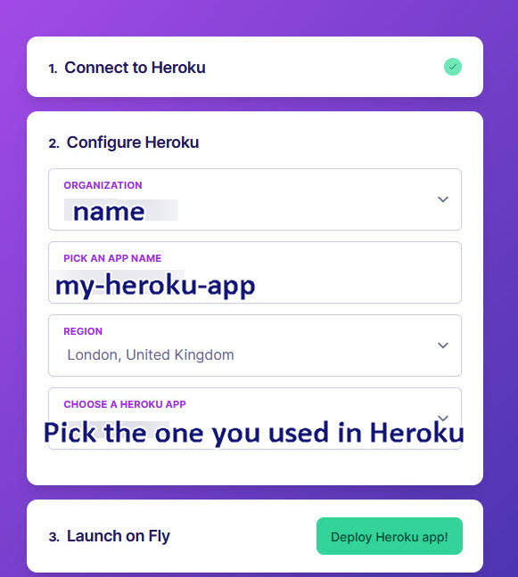
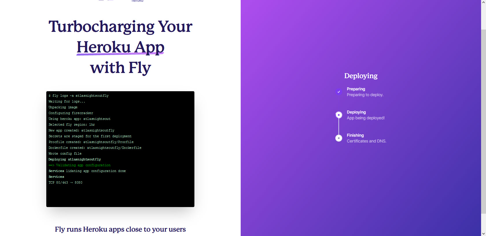
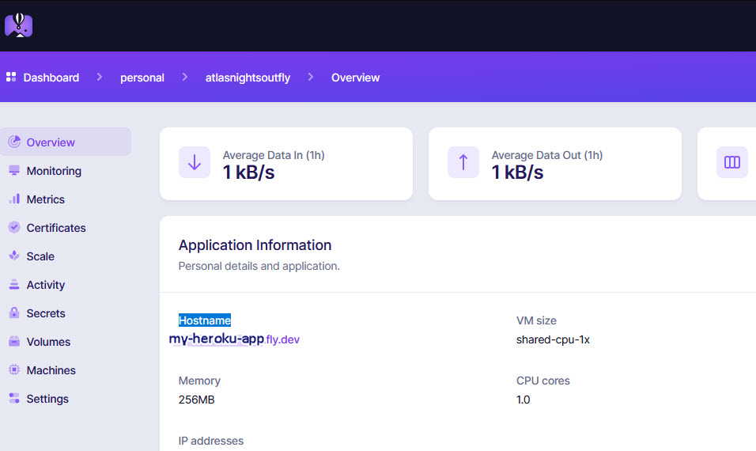

<!-- this is  on github live server!
docs made by D.Galloway 2019- 2021-->

For full Website content visit [The Diabetic Way](https://www.thediabeticway.co.uk/index.php/en/).

###  **Fly_io for Nightscout** 

Credit too:Big thanks to Robby,  for the idea, links putting it together, implementing the installer, and testing everything with myself for the docs, and Robby for the tips. 

## Upcoming changes made:
Process:old heroku accout to a new Turbo Fly_io Account.   

</a>	
 

### **So with all that, let’s set up a free Turbo Account on Fly_io  **
You will need to keep to the free Tier for this setup to be free, in you having a nightscout site again totaly free. This could change and we are not fully knowing for how long it will be free, all we know is as long as you stick to the free tire Requirements it should be free. Lets hope for life. 

## [Fly_io Account ±]()  

#### 1.	Setup Fly_io Account: By going to https://fly.io/launch/heroku or <a href=" https://fly.io/launch/heroku" target="_blank" title="Account">Fly_io Account</a>
<a href="https://www.noip.com/" target="_blank">
  

</a> 

### 2. Fill in your organization name, pick a App name you would like (I have just done an example in the image above for these instruction!) and choose your Heroku app you used on Heroku 
You will then be asked to fill in your payment details
Fill in your payment details, don't worry,you will not be charged if you keep to a free tier as outlined.
 

</a>	
 

### 3. After filling in and setting up your payment details go back to the page you just come from before you filled in the payment details, and carry on the Deploying process  from the Heroku site. This can take a while to do.. 

</a>	

### 4.  Sit back have another cuppa.  

### 5.  Fly_io Dashboard  
You should now be able to see or be at your Fly_io Dashboard and be presented with your Hostname  

**Host Name**
	
 

**Dashboard** 

</a></a>

##  **We now need to setup Xdrip**

We need to use Xdrip to upload are CGM readings to Nightscout and it will need you to enter the correct URL in it's setting for Nightscout to start receiving readings from your CGM!  You may use other software other than Xdrip+ but for this tutorial I will be using xdrip+ you will have to excuse me if I just put xdrip as I keep forgetiing to put the + 

### 6. **Set up xDrip to upload to your Nightscout**  
Also see here if you like other wise carry on below!S 
 [Base URL - Set up xDrip to upload to your Nightscout ±](../xdrip/xdrip%20-%20Base.md#1-set-up-xdrip-to-upload-to-your-nightscout)  

This is what you need to do in xDrip on your master (Main) Mobile. 
#### a. Go to xDrip Settings −> Cloud Upload −> Nightscout Sync (REST-API) 

</a></a></a>
 
#### b. Select Enable at the top, if not already enabled. 
</a>
#### c. Tap on Base URL. Enter the following Url. Remeber yours will be different than what I show you here. You will need to add your Secret-API and your Host to the set out code!
https://**ThisIsyourSecret-API**@**thisisyourHostName**/api/v1/ 
If you  forgot or lose your secret-API it can be located at Heroku/ Settings/Config Vars and look down the list for API_SECRET 
This will now be located in a differrent place now within Fly_io 

Your Host name is located in your Fly_io Dashboard.

</a>
 

#### d. (Reminder)Tap on Base URL. Enter the following. https://API-Secret@hostname/api/v1/   

That’s it. Your xDrip readings should now upload to your Nightscout web site. 
If you do not see levels after 5 mins, triple check the way you have added your Base URL correctly, it is very case sensitive!with no spaces 

### 7. **Set up xDrip uploader to go to your AndroidAPS**  
#### Basic settings for Most CGM 
This is the same has above except your Url will be your web address for Fly_io Host address, not like xdrip's where it has Both Secret and Fly_io host on one line with the added api/v1 at the end of it 
On AASP it is done seperatly, you add your Nightscout Web URL and then add your Secret in NS API secret below.There is no api/v1 in it 

</a>
 

#### a. Set your Nightscout URL e.g. https://yoursitesname.fly.dev/ 

#### b. You will also need to Disable **Upload treatments** and **Back-fill data** from xDrip+, or else treatments can be doubled in AAPS leading to false COB and IOB. 

#### c. **Alert on failures** should also be deactivated. 

These are in your settings/Cloud Upload/Nightscout Sync (REST-API) / Extra Options. 

</a>
 

#### d. Also Disable **Automatic Calibration** you can enable it for the first time but then after that it will need to be Disabled.  you can do this by selecting the Download treatments  to switch Automatic calibration (on/Off)

You can do this at: Settings/Cloud Upload/Nightscout Sync (REST-API) / 

</a>
 

### 8. **Setting up xDrip as a (follower) like for your dad from the example from above**

This will be on your **followers mobile phone,** not your own.
#### 1. In the xDrip Settings / Hardware Data Source, choose “Nightscout Follower” as the hardware data source. See  [xdrip - Base URL](../xdrip/xdrip%20-%20Base.md#1-setting-up-xdrip-as-a-follower-for-your-dad) for more information 

</a></a>
 

##  **Issues or Concerns** 

If you have any issues or concerns please post your questions in the   <a href=" https://www.facebook.com/groups/5390196001057776" target="_blank" title="Facebook xDrip - UK"> Facebook Group</a> or you can go to the **Discussions** on <a href=" https://github.com/NightscoutFoundation/xDrip/discussions" target="_blank" title="Discussions"> Github</a> 

  ## To Be continued!

	

  

Why Not take visit [UK Wide Cycle Ride - Diabetes.uk](https://cycle.diabetes.org.uk/) or  [Swim22 - Diabetes.uk](https://swim22.diabetes.org.uk/) for your Diabetes Needs!
  

 <!--

<table width="1166" border="1" style="border-color: #000000; background-color: #ffffff;" cellpadding="1" cellspacing="1" height="98">
<tbody>
<tr style="height: 16px;">
<td style="width: 1158px; border-color: #000000; background-color: #5B9BD5;" fff="">Note!  If you prefer video, see below</td>
</tr>
<tr style="height: 56.4063px;">
<td style="width: 1158px; border-color: #000000;">
<iframe width="850" height="415" src="https://www.youtube.com/embed/gUEqZAfPEZ4" title="YouTube video player" frameborder="0" allow="accelerometer; autoplay; clipboard-write; encrypted-media; gyroscope; picture-in-picture" allowfullscreen></iframe>  </td>
</tr>
</tbody>
</table>

-->

<!--  
  ******************************************************************************************************************
  mkdocs.yml    # The configuration file.
    docs/
    index.md  # The documentation homepage.
       ...       # Other markdown pages, images and other files.
		
		*************************************************************************
		center text**
		## 
Now Do  
 
		
		*************************************************************
		
********************************************
    Adding exernal link to other a web sites
**********************************************
# 
Part 2: <a href=" https://atlas-night-out.github.io/my-project/user-guide/Setting_up_Heroku_Account_part2/" target="_blank" title="Setting up Heroku Account">Setting up Heroku Account</a> 

 
**********************************************
external link with image 

		
		
		
		
adding 	Yellow Hightligher!!!!!!!!	with bold too
**Marked text**

adding 	Green Hightligher!!!!!!!!	with bold too
**Marked text**

	

Adding a image with link
 

link
<a href=" https://github.com/" target="_blank" title="First create a user account by going to">Click Here</a>

  </a>	

Adding a image with link
 

Adding Video

<iframe width="850" height="415" src="https://www.youtube.com/embed/MFsbm45b6YY" title="YouTube video player" frameborder="0" allow="accelerometer; autoplay; clipboard-write; encrypted-media; gyroscope; picture-in-picture" allowfullscreen></iframe>

Adding an embeded video
<iframe id="video3" width="560" height="315" src="https://www.youtube.com/embed/o7-T2IrDJ_A" title="YouTube video player" frameborder="0" allow="accelerometer; autoplay; clipboard-write; encrypted-media; gyroscope; picture-in-picture" allowfullscreen></iframe>

Note
**Note:** a note is something that needs to be mentioned but is apart from the context.

List
This is a regular paragraph.

Paragraph:

1. **Now Open another tab**  to make a Mongodb Atlas** Account: <a href="https://www.mongodb.com/cloud/atlas" target="_blank" title="Click Start Free">See Here</a> 
  and **click** Start Free
 
   2. Sub item two
   3. Sub item three
2. Item two

font size

link
<a href=" https://github.com/" target="_blank" title="First create a user account by going to">Click Here</a>

Table
| Syntax | Description |
| ----------- | ----------- |
| Header | Title |
| Paragraph | Text |

Video in a box border!

<table width="1166" border="1" style="border-color: #000000; background-color: #ffffff;" cellpadding="1" cellspacing="1" height="98">
<tbody>
<tr style="height: 16px;">
<td style="width: 1158px; border-color: #000000; background-color: #5B9BD5;" fff="">video Instructions,</td>
</tr>
<tr style="height: 56.4063px;">
<td style="width: 1158px; border-color: #000000;">
 <iframe id="video3" width="860" height="515" src="https://www.youtube.com/embed/6o3AdkQBVog" title="YouTube video player" frameborder="0" allow="accelerometer; autoplay; clipboard-write; encrypted-media; gyroscope; picture-in-picture" allowfullscreen></iframe>  </td>
</tr>
</tbody>
</table>
*****************************************************
Warning Note<table width="1266" border="1" style="border-color: #000000; background-color: #ffffff;" cellpadding="1" cellspacing="1" height="98">
<tbody>
<tr style="height: 16px;">
<td style="width: 1158px; border-color: #000000; background-color: #FF0000;" fff=""><strong>Warning!</strong></td>
</tr>
<tr style="height: 56.4063px;">
<td style="width: 1158px; border-color: #000000;"> 1: Some new features, updates, or bug fixes may require that you clear your browser cache before you will see the changes taken effect  2: If you get no errors and no readings after a while see about doing a <a href="http://127.0.0.1:8000/user-guide/Redeploying%20your%20repository/" target="_blank" title="Redeploying your repository link">Redeploying your repository</a> </td>
</tr>
</tbody>
</table>

-->

