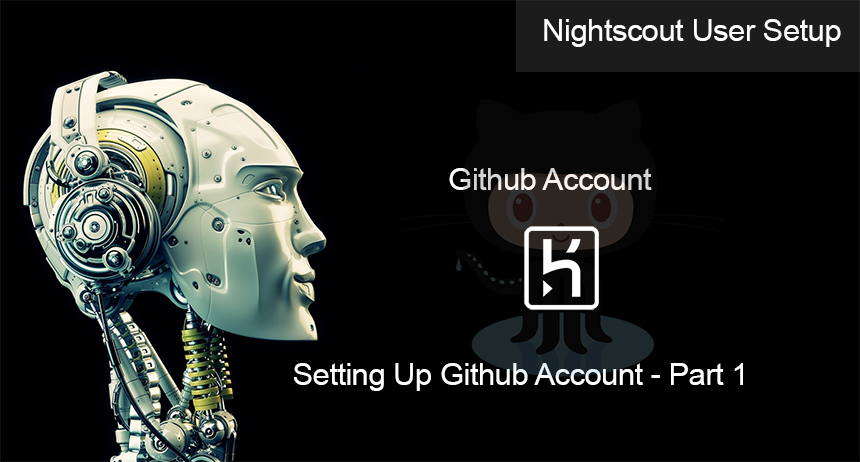

# Welcome to The Diabetic way

For full Website content visit [The Diabetic Way](https://www.thediabeticway.co.uk/index.php/en/).
 
 

 

### Part 1: Setting up the Github for Nightscout  

For setting up Nightscout I have used a Dexcom G6 with xdrip as my uploader as well as Android APS, but I will imagine they will also work
with other devices and setups too! You do this at your own risk as my instructions are for educational purposes only and you should check with your GP or specialist or Endo, not sure how many more names I need to put here for doctors 😊  as I do not know all the worlds ways they are treated!
  

## If you would like to follow these instructions with video then see below other wise continue step by step below   
  
  
<table width="1166" height="600" border="1" style="border-color: #000000; background-color: #ffffff;" cellpadding="1" cellspacing="1" height="598">
<tbody>
<tr style="height: 16px;">
<td style="width: 1158px; border-color: #000000; background-color: #5B9BD5;" fff="">video Instructions,</td>
</tr>
<tr style="height: 56.4063px;">
<td style="width: 1158px; border-color: #000000;">
 <iframe id="video9" width="860" height="515" src="https://www.youtube.com/embed/6o3AdkQBVog" title="YouTube video player" frameborder="0" allow="accelerometer; autoplay; clipboard-write; encrypted-media; gyroscope; picture-in-picture" allowfullscreen></iframe>  </td>
</tr>
</tbody>
</table> 
  
  
 
 
###1. First **Sign up for Github Acount**   <a href=" https://github.com/" target="_blank" title="Github">Click Here</a> 
     

###2. Fill in all of your account  details  on screen and keep them written down in a safe place to keep. 

###3.  
###3.1.

  
 
###4. After filling in your details you will then need to do a **puzzle** Puzzle 

  
</a> 
###5. After doing the puzzle you will be sent an email, so **check your email**  for the code sent to you!  

  
</a> 
###6. Now **enter the code** sent to you to finish the setup 

  
</a> 
###7. Just fill in the rest of the details to what you want to use in my case I SELECTED all the tools needed!  

</a> 
###8. Now click on the **Cat icon**  to get to your main Github account.  

</a> 
###9. Click this <a href=" https://github.com/nightscout/cgm-remote-monitor" target="_blank" title="Nightscout Main Repository">Link</a> to take you to the **Nightscout Main Repository** make sure to open it in a new tab: https://github.com/nightscout/cgm-remote-monitor  
<iframe id="video3" width="560" height="315" src="https://www.youtube.com/embed/6o3AdkQBVog?start=172" title="YouTube video player" frameborder="0" allow="accelerometer; autoplay; clipboard-write; encrypted-media; gyroscope; picture-in-picture" allowfullscreen></iframe> 
###10. Now fork it from **Nightscout Main repository** to your own respository (in my case)  **thediabeticway23**  

###11. Once you have forked it from Nightscout Repo to your own repo you should be able to go to it, to see all the files!

<iframe id="video3" width="560" height="315" src="https://www.youtube.com/embed/M78KtZ5WbYw" title="YouTube video player" frameborder="0" allow="accelerometer; autoplay; clipboard-write; encrypted-media; gyroscope; picture-in-picture" allowfullscreen></iframe>

  

<table width="1166" Height="270" border="1" style="border-color: #000000; background-color: #ffffff;" cellpadding="1" cellspacing="1" height="98">
<tbody>
<tr style="height: 16px;">
<td style="width: 1158px; border-color: #000000; background-color: #db4e12;" fff=""><strong>Note!</strong></td>
</tr>
<tr style="height: 56.4063px;">
<td style="width: 1158px; border-color: #000000;">Bookmark this page,( thediabeticway23 / cgm-remote-monitor) for revisits from time to time. 
In your case the name you made for ( Your Github account name / cgm-remote-monitor)
 
  I would also bookmark the Nightscout Repo for updates later, (  nightscout / cgm-remote-monitor) <a href=" https://github.com/nightscout/cgm-remote-monitor" target="_blank" title="Nightscout Main Repository">Here</a> </td>
</tr>
</tbody>
</table>
 
## 
Now we need to Do  

 
# 
Part 2: <a href=" https://atlas-night-out.github.io/Xdrip-AndroidAps-Nightscout-readthetips/Nightscout/Setting_up_Heroku_Account_part2/" target="_blank" title="Setting up Heroku Account">Setting up Heroku Account</a> 

 

 https://atlas-night-out.github.io/Xdrip-AndroidAps-Nightscout-readthetips/Nightscout/Setting_up_Heroku_Account_part2/
  
### Diabetes UK
<a href="https://www.diabetes.org.uk/" target="_blank">
 
 
</a>               Why Not take visit [UK Wide Cycle Ride - Diabetes.uk](https://cycle.diabetes.org.uk/) **or**  [Swim22 - Diabetes.uk](https://swim22.diabetes.org.uk/) **or** [Month of Miles - Diabetes.uk](https://monthofmiles.diabetes.org.uk/?gclid=CjwKCAjwz5iMBhAEEiwAMEAwGO2_OoOGRQdN3BDD3NUQ8WoYAsJsxd1YUJN8dSVJowD1E4AjJ1RdVxoC9bgQAvD_BwE) for all of your Diabetes Needs!

  <!--  
  ******************************************************************************************************************
  mkdocs.yml    # The configuration file.
    docs/
    index.md  # The documentation homepage.
       ...       # Other markdown pages, images and other files.
		
		*************************************************************************
		center text**
		## 
Now Do  
 
		
		*************************************************************
		
********************************************
    Adding exernal link to other a web sites
**********************************************
# 
Part 2: <a href=" https://atlas-night-out.github.io/my-project/user-guide/Setting_up_Heroku_Account_part2/" target="_blank" title="Setting up Heroku Account">Setting up Heroku Account</a> 

 
**********************************************

		
		
		
		
adding 	Yellow Hightligher!!!!!!!!	with bold too
**Marked text**

	

Adding a image with link
 

Adding Video

<iframe width="850" height="415" src="https://www.youtube.com/embed/MFsbm45b6YY" title="YouTube video player" frameborder="0" allow="accelerometer; autoplay; clipboard-write; encrypted-media; gyroscope; picture-in-picture" allowfullscreen></iframe>

Adding an embeded video
<iframe id="video3" width="560" height="315" src="https://www.youtube.com/embed/o7-T2IrDJ_A" title="YouTube video player" frameborder="0" allow="accelerometer; autoplay; clipboard-write; encrypted-media; gyroscope; picture-in-picture" allowfullscreen></iframe>

Note
**Note:** a note is something that needs to be mentioned but is apart from the context.

List
This is a regular paragraph.

Paragraph:

1. **Now Open another tab**  to make a Mongodb Atlas** Account: <a href="https://www.mongodb.com/cloud/atlas" target="_blank" title="Click Start Free">See Here</a> 
  and **click** Start Free
 
   2. Sub item two
   3. Sub item three
2. Item two

font size

link
<a href=" https://github.com/" target="_blank" title="First create a user account by going to">Click Here</a>

Table
| Syntax | Description |
| ----------- | ----------- |
| Header | Title |
| Paragraph | Text |

Video in a box border!

<table width="1166" border="1" style="border-color: #000000; background-color: #ffffff;" cellpadding="1" cellspacing="1" height="98">
<tbody>
<tr style="height: 16px;">
<td style="width: 1158px; border-color: #000000; background-color: #5B9BD5;" fff="">video Instructions,</td>
</tr>
<tr style="height: 56.4063px;">
<td style="width: 1158px; border-color: #000000;">
 <iframe id="video3" width="860" height="515" src="https://www.youtube.com/embed/6o3AdkQBVog" title="YouTube video player" frameborder="0" allow="accelerometer; autoplay; clipboard-write; encrypted-media; gyroscope; picture-in-picture" allowfullscreen></iframe>  </td>
</tr>
</tbody>
</table>
*****************************************************
Warning Note<table width="1266" border="1" style="border-color: #000000; background-color: #ffffff;" cellpadding="1" cellspacing="1" height="98">
<tbody>
<tr style="height: 16px;">
<td style="width: 1158px; border-color: #000000; background-color: #FF0000;" fff=""><strong>Warning!</strong></td>
</tr>
<tr style="height: 56.4063px;">
<td style="width: 1158px; border-color: #000000;"> 1: Some new features, updates, or bug fixes may require that you clear your browser cache before you will see the changes taken effect  2: If you get no errors and no readings after a while see about doing a <a href="http://127.0.0.1:8000/user-guide/Redeploying%20your%20repository/" target="_blank" title="Redeploying your repository link">Redeploying your repository</a> </td>
</tr>
</tbody>
</table>

-->

