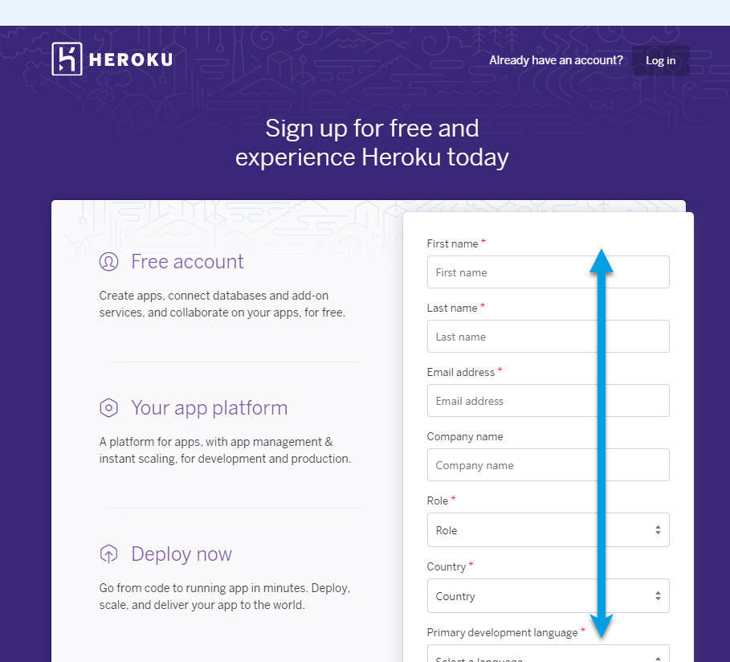
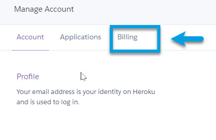

<!-- this is on github live server !
docs made by D.Galloway 2019- 2021-->
# Welcome to The Diabetic way

For full Website content visit [The Diabetic Way](https://www.thediabeticway.co.uk/index.php/en/).
 
 

  

## **Part 2 Setting up a Heroku Account for Nightscout**  
 
<table width="1166" Height="148" border="1" style="border-color: #000000; background-color: #ffffff;" cellpadding="1" cellspacing="1" height="98">
<tbody>
<tr style="height: 16px;">
<td style="width: 1158px; border-color: #000000; background-color: #5B9BD5;" fff=""><strong>Note!</strong></td>
</tr>
<tr style="height: 56.4063px;">
<td style="width: 1158px; border-color: #000000;"> You will have already needed to have done <a href=" https://atlas-night-out.github.io/my-project/user-guide/Setting_up_Github_Account_part1/" target="_blank" title=" Part 1 Setting up Github Account for Nightscout.">Part 1 Setting up Github Account for Nightscout</a>. To be able to continue.</td>
</tr>
</tbody>
</table>
 
 
### **Now we are going to create a Heroku account.**  
###1. First you will need go to Heroku web page and create an account for yourself <a href=" https://signup.heroku.com" target="_blank" title="Heroku Account">Click Here</a> or: https://signup.heroku.com  **And enter all your account details**. 
	

First Name, last name, email address
“Role” and “Primary development language” can be anything, but “Hobbyist” and “Node js” are the most appropriate choices. **And click on Create your free Account**  
###2. Now go to verify your account via the link in the verification email that’s sent to you, and then set your password. 
 
###3. Click **Later** for Secure your Account this can be done later! 
 
###4. Your Heroku page will open, now click on your profile picture, in the top right corner, and **select Account Settings**  
 

<table width="1166" Height="178" border="1" style="border-color: #000000; background-color: #ffffff;" cellpadding="1" cellspacing="1" height="98">
<tbody>
<tr style="height: 16px;">
<td style="width: 1158px; border-color: #000000; background-color: #5B9BD5;" fff=""><strong>Note!</strong></td>
</tr>
<tr style="height: 56.4063px;">
<td style="width: 1158px; border-color: #000000;"> Unless you willingly select billable features, your credit card information is only used for verifications and you will not be charged anything. Worst case you’ll be charged £0.00</td>
</tr>
</tbody>
</table> 
###5.  Click on **Billing** 
 
###6.  Click on your **credit card details** 
 
###7.  Enter your **credit card Details** and click Save Details 
 

### You should now have 2 web pages open: **Github** and **Heroku** Leave them open.  
**Heroku**
  
**Github**
  

## 
Now we need to do  

 
# 
Part 3: <a href="https://atlas-night-out.github.io/Xdrip-AndroidAps-Nightscout-readthetips/Nightscout/Setting_up_Atlas_Account_part3/">Set up a Atlas Account</a> 

 

**********************************************************************************************

 
<a href="https://www.diabetes.org.uk/" target="_blank">
 
 
</a>               Why Not take visit [UK Wide Cycle Ride - Diabetes.uk](https://cycle.diabetes.org.uk/) **or**  [Swim22 - Diabetes.uk](https://swim22.diabetes.org.uk/) **or** [Month of Miles - Diabetes.uk](https://monthofmiles.diabetes.org.uk/?gclid=CjwKCAjwz5iMBhAEEiwAMEAwGO2_OoOGRQdN3BDD3NUQ8WoYAsJsxd1YUJN8dSVJowD1E4AjJ1RdVxoC9bgQAvD_BwE) for all of your Diabetes Needs!

<!--  
***********************************************************************************************************************************************************
below needs removing when finished!!!!!!!!!!!!!
*************************************************************************************************************************************************************

8. Now go back to your Github account, and make sure you’re in your ( Your Github account name / cgm-remote-monitor) 

In your case it will be ( Your Github Account Name / cgm-remote-monitor)
 

 
Github_cgm-remote-monitor-Repository
Github_cgm-remote-monitor-Repository
 

In the repository, scroll down to where the Readme file is displayed, and click the Purple Deploy to Heroku button.
 

If you are doing this process on a phone or tablet, you may not see the Readme displayed on scrolling — have your browser load the Desktop version of the page first.
 

 

Make sure to write all settings down if you can! Things like App name, API secret you will need in a lot of other setups so it’s important to document it.
On the Heroku screen that opens, fill in the information requested:
App name: Your site will have a URL like “your-app-name.herokuapp.com”. This is where you choose the “your-app-name” part. In my case I called mine app-name: t1diabetics
Region: No matter where you are, this setting does not impact you; leave it on United States.
Config Vars: Most of these are populated with defaults that will be fine for a typical setup. All of them can be edited later. There are a few you will want to note during this setup though:
API SECRET: This is required. Enter a passphrase you will use for your site. It has to be   12 characters no less or you will get errors!
BG HIGH, BG LOW, BG TARGET BOTTOM, and TARGET TOP:
The thresholds at which your site will alert you. HIGH and LOW are your “urgent” thresholds
TARGET BOTTOM and TARGET TOP
are the top and bottom of your “good” ranges.
As of version 13.0, these values can be entered in either mg/dl or mmol/L
I will do another Video on the setup of the Bridge Server, ignore this for now.
If you are outside the US, set BRIDGE SERVER to “EU” (in capitals, without the quotation marks. If you are inside the US, leave it as it is.
DISPLAY UNITS: Units will be mg/dl by default. If you want mmol/L, enter “mmol” or “mmol/L” here.
ENABLE: This variable that turns on all the features you want to use with adding plug in’s
There’s a list of all of the plug in’s and what they do here. (The ones you can choose to enable are under the heading “Advanced Plug in’s”)
See Link in description below:
https://github.com/nightscout/cgm-remote-monitor#plugins
Now click the Deploy app button at the bottom of the page.
Heroku will begin deployment, going through a list of automated steps at the bottom of the page. This process can take a while be patient!
During the “Configure environment” step, you will be asked to add a credit/debit card to the account.
All Heroku accounts need a card on file to verify the account and allow for paid add-ons. You will never be charged without explicitly opting into extra levels of service, and for a typical Nightscout site you won’t ever need anything extra.
 

Fill in your details, you will never be charged without explicitly opting into extra levels of service, and for a typical Nightscout site you won’t ever need anything extra
Sometimes you might have an error or issue’s in doing this process due to incorrect password or need to verify again then go to https://heroku.com/verify
After adding your Card Details again, Click save
and go back to the Deployment page.
Click the Deploy app button again, and it should complete this time.
Again, this will take a few minutes be patient!
Congratulations! Your app was successfully deployed
Right click View to open in a new tab also Right click Manage App so both are open in new tabs
I got a error due to the API Secret password being incorrectly done!
Go to your Heroku Account you just made.
You are now in your Heroku Account
Go to Settings
Select Reveal Config Vars
Scroll down until you come to the API Secret and edit it and make sure password is 12 characters
Click save
Now go back and refresh your Nightscout Site you created
Your Heroku site is now created
Make sure to write your Nightscout App URL down for safe keepings as will need this later.
We now need to add your Nightscout App URL into Xdrip for your CGM data to go to Nightscout there are lots of different ways to do this, but for this setup I’m going to show you in Xdrip how to add base URL into it, which will be in another video.
We will also need to setup your profile editor which I will also do in another video
 

If you have not setup xdrip already see my other video on utube How to Installing Xdrip at https://youtu.be/7Qwr4HrchTU It is also on The Diabetic way Website
 

Has you will need to have xdrip installed before we can add your base URL for Nightscout to work
Please note this xdrip setup was not made with the same Github accounts so urls and names will be different until I can make an updated xdrip video.
Now we need to see How to add Base URL into xDrip
See Part 3 How to add Base URL into Xdrip

h) Add a database username (for example nightscout) and a database password (in the example below soo5ecret but please change it!).

 

Write down these credentials in the boxes below (yes, in this browser window you're reading now, unless you're reading a printed version). You’ll need them later.

 
Database password:<input type="text" id="myPwd" value="click here, delete and put your own " size="32">
 

Database username:<input type="text" id="myUsr" value="click here, delete and put your own" size="32">

 
Paste the string in the box below `(yes, in this browser window you're reading now, unless you're reading a printed version)`
<input type="text" id="myAtlas" value="click here, delete and paste your Atlas connection string" size="100">
 

Database Name: <input type="text" id="mydB" value="click here, delete and put your own" size="30">
 
Click the Generate button (just here below this line: in this browser window you're reading):

 

<button onclick="Generate()">Generate</button>

Field1: <input type="text" id="field1" value="Hello World!"> 
Field2: <input type="text" id="field2">  
Field3: <input type="text" id="field3">  
<button onclick="myFunction()">Copy Text</button>

A function is triggered when the button is clicked. The function copies the text from Field1 into Field2.

This is a regular paragraph.

Paragraph:

1. **Now Open another tab**  to make a Mongodb Atlas** Account: <a href="https://www.mongodb.com/cloud/atlas" target="_blank" title="Click Start Free">See Here</a> 
  and **click** Start Free
 
      2. **No need to do this part** but I did.
  
      3. Sub item three 
2. Item two

* Enter your information and then click Get Started Free
  
  
  
  Select Create a cluster in Shared Clusters (FREE)
  
  
 
  
  Leave all default values and click Create Cluster
  
  
  
  
  
  Atlas will create your default cluster, wait until it is complete... (can take more than 3 minutes)
  
  
  
   Click on CONNECT
   
   
   f. Click on Allow Access from Anywhere
   
   
   Click on Add IP Address
   
   
   
   
   h) Add a database username (for example nightscout) and a database password (in the example below soo5ecret but please change it!).
   
   
   i) Then click Create Database User.
   
   
   j)Click on Choose a connection method
   
   
   Select Connect your application
   
   
   
   Copy the connection string: click Copy and paste it somewhere to edit it (like Notepad).
   

 

Check what version you are upto on your Nightscout site. In my example I'm on version  14.06 (Liquorice)

<table width="1166" border="1" style="border-color: #000000; background-color: #ffffff;" cellpadding="1" cellspacing="1" height="98">
<tbody>
<tr style="height: 16px;">
<td style="width: 1158px; border-color: #000000; background-color: #5B9BD5;" fff="">Note! video, see below</td>
</tr>
<tr style="height: 56.4063px;">
<td style="width: 1158px; border-color: #000000;">
<iframe width="850" height="415" src="https://www.youtube.com/embed/MFsbm45b6YY" title="YouTube video player" frameborder="0" allow="accelerometer; autoplay; clipboard-write; encrypted-media; gyroscope; picture-in-picture" allowfullscreen></iframe>  </td>
</tr>
</tbody>
</table>

Updating your website to the latest version
 <a href="https://github.com/nightscout/cgm-remote-monitor/releases" target="_blank" title="Nightscout Release Versions">See Here</a> for the 
 current released version at moment) is easy with the update tool linked below. 

 
## Instructions

These instruction have been made on the 28 **April 2021** 
 
<table width="1166" border="1" style="border-color: #000000; background-color: #ffffff;" cellpadding="1" cellspacing="1" height="98">
<tbody>
<tr style="height: 16px;">
<td style="width: 1158px; border-color: #000000; background-color: #5B9BD5;" fff=""><strong>Note!</strong></td>
</tr>
<tr style="height: 56.4063px;">
<td style="width: 1158px; border-color: #000000;">Azure Users
as of 0.12, Nightscout no longer supports the free Azure platform now. If you really want to keep using Azure, don’t update to any version above 0.12</td>
</tr>
</tbody>
</table>
 

# Step 1 Update Github Repo

* Log into your GitHub Account.<a href="https://github.com/" target="_blank" title="GitHub Login">-- Here --</a>
**Wait**: Make sure you’re actually signed into your GitHub account and **Check** by looking in the upper right corner of the page to verify. You cannot do this later.**Best to do it now!.** 
😉  

* Now<a href="http://nightscout.github.io/pages/update-fork/" target="_blank" title="Update Tool">-- Click Here --</a> to open the **update tool or image below!**for Nightscout in a new tab from Github. Make sure both are open 

* Enter your GitHub **username** and click the blue button that says Check for updates. (Note: your username is not an email address.) 

click the blue button that says**Checks for updates**

* If an update is available, the tool will tell you this,and provide directions for you, and also give you a button that will take you to **GitHub** to finish the process.

 
  
* **Click the Continue updating at GitHub button.** Review the directions on the screen that pops up, and continue.

## step 1 `(see Step1 & Step2 video below)`

* **Click "Create pull request"** Your fork must be on the left side  

 and the **nightscout/cgm-remote-monitor must be on the right.** 
 
## step 2 create pull request

* Click **"Create pull request” again,** do not change the comparison. Your fork must be on the left side and the nightscout/cgm-remote-monitor must be on the right side.

* ** Also Give your pull request a name** like “Update” or “Sweet Liquorice Update” — doesn’t really matter what this is.

## Step 1 & Step 2 Video
 

<table width="1166" border="1" style="border-color: #000000; background-color: #ffffff;" cellpadding="1" cellspacing="1" height="98">
<tbody>
<tr style="height: 16px;">
<td style="width: 1158px; border-color: #000000; background-color: #5B9BD5;" fff="">step 1 & Step 2 Video</td>
</tr>
<tr style="height: 56.4063px;">
<td style="width: 1158px; border-color: #000000;">
<iframe width="850" height="415" src="https://www.youtube.com/embed/6tGsLOE1BuE" title="YouTube video player" frameborder="0" allow="accelerometer; autoplay; clipboard-write; encrypted-media; gyroscope; picture-in-picture" allowfullscreen></iframe>  </td>
</tr>
</tbody>
</table>

  

## step 3 merge pull request

* Click **"Merge pull request**

  
* or see video below
 
<table width="1166" border="1" style="border-color: #000000; background-color: #ffffff;" cellpadding="1" cellspacing="1" height="98">
<tbody>
<tr style="height: 16px;">
<td style="width: 1158px; border-color: #000000; background-color: #5B9BD5;" fff="">Note! video,</td>
</tr>
<tr style="height: 56.4063px;">
<td style="width: 1158px; border-color: #000000;">
<iframe width="850" height="415" src="https://www.youtube.com/embed/gUEqZAfPEZ4" title="YouTube video player" frameborder="0" allow="accelerometer; autoplay; clipboard-write; encrypted-media; gyroscope; picture-in-picture" allowfullscreen></iframe>  </td>
</tr>
</tbody>
</table>

## step 4 confirm merge
 
* Now Click the  **Confirm merge button.**

## step 5 merged

* If you see **"Merged" in purple,** you have successfully updated your fork. If you're using Heroku you will need to to push the Deploy Branch button, in the Manual deploy section of the Deploy page.

* **You have successfully updated your GitHub repository**, now let's deploy it in Heroku.
 
 
<table width="1166" border="1" style="border-color: #000000; background-color: #ffffff;" cellpadding="1" cellspacing="1" height="98">
<tbody>
<tr style="height: 16px;">
<td style="width: 1158px; border-color: #000000; background-color: #db4e12;" fff=""><strong>Note!</strong></td>
</tr>
<tr style="height: 56.4063px;">
<td style="width: 1158px; border-color: #000000;">If you’re on Heroku and have Automatic Deploys enabled, you’re done! 
 If you don’t have Automatic Deploys on yet, or aren’t sure, run through these steps below!</td>
</tr>
</tbody>
</table>

# Step6: Deploy in Heroku
 

 
* Log into <a href="https://id.heroku.com/login" target="_blank" title="Nightscout Release Versions">Heroku</a>  

* Select your app `(In my case The Dibetic Way)`

 

* In the middle bit, click on the GitHub button if it isn’t already showing as connected. It will ask you to authorize the connection if you’re doing it for the first time.

 

* Type “cgm” into the repo-name search box, and click Search
 

* Click the Connect button once it finds your cgm-remote-monitor repository. You should now be connected
 

<table width="1166" border="1" style="border-color: #000000; background-color: #ffffff;" cellpadding="1" cellspacing="1" height="98">
<tbody>
<tr style="height: 16px;">
<td style="width: 1158px; border-color: #000000; background-color: #5B9BD5;" fff="">Note! see video</td>
</tr>
<tr style="height: 56.4063px;">
<td style="width: 1158px; border-color: #000000;">
<iframe width="850" height="415" src="https://www.youtube.com/embed/5S2lcc5XY_g" title="YouTube video player" frameborder="0" allow="accelerometer; autoplay; clipboard-write; encrypted-media; gyroscope; picture-in-picture" allowfullscreen></iframe>  </td>
</tr>
</tbody>
</table>
  
* Or if Heroku is not connected to GitHub, scroll down and click Connect to GitHub, if a popup window opens and requires authorization, click Authorize Heroku
 
  
* Now after connecting to Gitnub, Scroll down to the bottom of the page, make sure to select the master branch  and then click  Deploy Branch
 
  
</a>
 
* Build will start, do not interfere and wait for completion. It can take a while approximately around 10 minutes Do not Interrupt the process  has it can lead to a broken site and you'll need to restart again.
   
  
</a>
 
*  Wait until the deploy process completes and click View if nothing happens click Manage App then upper right Open App
 
  </a>
 
*  Your site will open and  it should be at the latest version on your Nightscout Site
 
* You're Finished! 
* Head over to your Nightscout site and check its updated!

<table width="1166" border="1" style="border-color: #000000; background-color: #ffffff;" cellpadding="1" cellspacing="1" height="98">
<tbody>
<tr style="height: 16px;">
<td style="width: 1158px; border-color: #000000; background-color: #5B9BD5;" fff="">Check if Nightscout as updated Video</td>
</tr>
<tr style="height: 56.4063px;">
<td style="width: 1158px; border-color: #000000;">
<iframe width="850" height="415" src="https://www.youtube.com/embed/MFsbm45b6YY" title="YouTube video player" frameborder="0" allow="accelerometer; autoplay; clipboard-write; encrypted-media; gyroscope; picture-in-picture" allowfullscreen></iframe>  </td>
</tr>
</tbody>
</table>
 

<table width="1166" border="1" style="border-color: #000000; background-color: #ffffff;" cellpadding="1" cellspacing="1" height="98">
<tbody>
<tr style="height: 16px;">
<td style="width: 1158px; border-color: #000000; background-color: #5B9BD5;" fff="">Helpfull Note!</td>
</tr>
<tr style="height: 56.4063px;">
<td style="width: 1158px; border-color: #000000;">
To let your site finish updating itself as soon as you update your fork in the future with another Pull Request, enable Automatic Deploys here (from the master branch):
                                                                  

<iframe width="850" height="415" src="https://www.youtube.com/embed/x73tDH-ln4A" title="YouTube video player" frameborder="0" allow="accelerometer; autoplay; clipboard-write; encrypted-media; gyroscope; picture-in-picture" allowfullscreen></iframe>   If you’ve just turned the Automatic thing on, you’ll need to manually do the first deploy — make sure the branch is on master, and click the Deploy Branch button:</td>
</tr>
</tbody>
</table>
 

<table width="1266" border="1" style="border-color: #000000; background-color: #ffffff;" cellpadding="1" cellspacing="1" height="98">
<tbody>
<tr style="height: 16px;">
<td style="width: 1158px; border-color: #000000; background-color: #FF0000;" fff=""><strong>Warning!</strong></td>
</tr>
<tr style="height: 56.4063px;">
<td style="width: 1158px; border-color: #000000;"> 1: Some new features, updates, or bug fixes may require that you clear your browser cache before you will see the changes taken effect  2: If you get no errors and no readings after a while see about doing a <a href="http://127.0.0.1:8000/user-guide/Redeploying%20your%20repository/" target="_blank" title="Redeploying your repository link">Redeploying your repository</a> </td>
</tr>
</tbody>
</table>
***********************************************************************************************************************************************************
above needs removing when finished!!!!!!!!!!!!!
*************************************************************************************************************************************************************
-->

  <!--  
  
  mkdocs.yml    # The configuration file.
    docs/
    index.md  # The documentation homepage.
       ...       # Other markdown pages, images and other files.
		
		
		
		
		
		
adding 	Yellow Hightligher!!!!!!!!	
**Marked text**

	

Adding a image

Adding Video

<iframe width="850" height="415" src="https://www.youtube.com/embed/MFsbm45b6YY" title="YouTube video player" frameborder="0" allow="accelerometer; autoplay; clipboard-write; encrypted-media; gyroscope; picture-in-picture" allowfullscreen></iframe>

Note
**Note:** a note is something that needs to be mentioned but is apart from the context.

List
This is a regular paragraph.

Paragraph:

1. **Now Open another tab**  to make a Mongodb Atlas** Account: <a href="https://www.mongodb.com/cloud/atlas" target="_blank" title="Click Start Free">See Here</a> 
  and **click** Start Free
 
   2. Sub item two
   3. Sub item three
2. Item two

font size

Table
| Syntax | Description |
| ----------- | ----------- |
| Header | Title |
| Paragraph | Text |

-->

