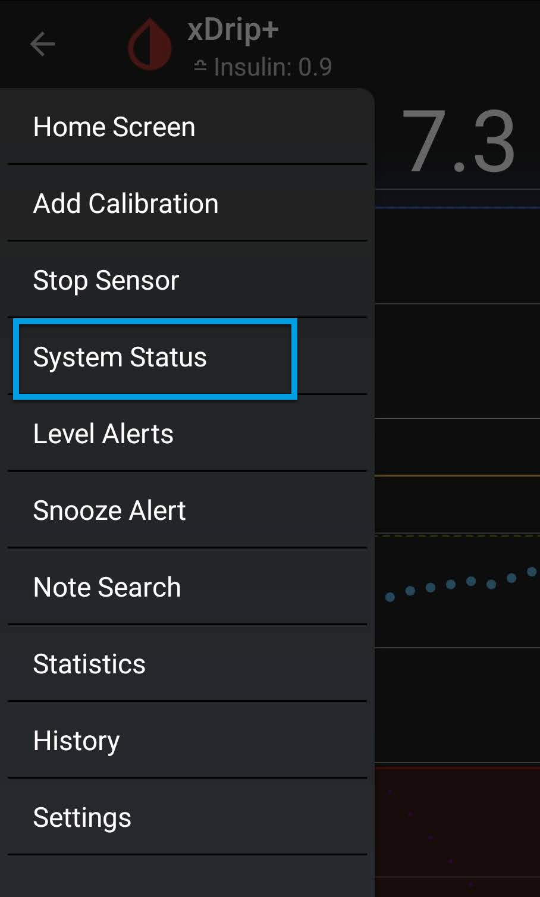

<!-- this is not on github server its local only and run my mkdocs server!
docs made by D.Galloway 2019- 2021-->

## G5/G6 System Status Page  
Go to Settings top left menu bar / System Status 

</a> 

</a> 
 
 
You can Swipe left or right on your screen to access different status pages.
Each status page has a specific heading. (Classic Status Page, **G5/G6 Status,** Followers, Uploaders) 

<iframe id="video7" width="260" height="440" src="https://www.youtube.com/embed/NK2td93ufdY" title="System Status" frameborder="0" allow="accelerometer; autoplay; clipboard-write; encrypted-media; gyroscope; picture-in-picture" allowfullscreen></iframe>

If you are using xDrip as the collector from Dexcom G5, G6 or Dexcom One, go to the G5/G6 status page with the “G5/G6 Status” heading. 

</a> 
 
The transmitter ID shown on this page is unique to your transmitter and can be used to interfere with your system. 

Be careful with whom you share it. Best you blackout the transmitter ID before posting a screenshot  on a forum as no one needs to see it in order to help you. 

## Classic Status Page

This page shows information about currently installed version, and in the past installed version.
For a new installation the **down gradable version** will show as 1603091400 by default. 

</a> 

**Version information**
 allows you to quickly <a href=" https://github.com/NightscoutFoundation/xDrip/releases" target="_blank" title="download xdrip">download xdrip</a> versions you are after. You will see the version date and the build version so that you can update or downgrade if you have any issues. 

Any **Version information** name that shows further information, like debug, dev, a smartwatch name, care link, will be  a [forked version release](../xdrip/xdrip%20-%20Download.md#forked-versions) of xDrip+ and might not contain all the latest functions of xdrip+ released app. 

</a> 

Also, on this page you will find the **Data Source: ** Type (one you selected to receive your BG values in my case a Dexcom G6)  
After the data source type, you'll see the name of the actual **Bluetooth Device:**  Serial number connected to xDrip+ 
**Connection Status:** is where you will see if you are connected to your transmitter. 
And the **Sensor Start Date:** (as entered as sensor start date and time, or automatically detected, depending on the sensor type). 

This page doesn't update automatically, you will need to touch the rounded arrows at the bottom to refresh it. 

</a> 

## Restart collector - Forget Device

</a> 

**Restart collector:** will restart xDrip+ Core collector mechanism. The effect depends on the data source. 
**Forget device:** will only have effect when xDrip+ is connected through Bluetooth to a device.
The device will be disconnected, and you will need to wait to pair a Bluetooth connection again. Best to slide to the G5/G6 Status page and wait to pair! 

## System Status
Wait for your transmitter to be connected 

</a>-</a> 

Do not continue until paired information is showing in the System Status page and battery showing. 

</a> 

Pair your transmitter **wait until it pops up** Bluetooth pairing request. 

</a> 

If not paired after a while do a **Forget Device** and then a **Restart Collector** on the **Classic Status Page** and wait in G5/G6 Status again for connection to pair.  

Can take a while but I would give it around 10 to 15 minutes until you try again. 

## Once connection is confirmed proceed to [Start Sensor](../xdrip/xdrip%20-%20Start%20Sensor.md#start-new-sensor)  .

## xDrip+ Sync Follower
[xDrip+ follower](../xdrip/Xdrip%20Follower%20Setup.md#xdrip-follower-setup) is a really handy tool to have and use, not only for others to follow you but also for yourself to share to other mobiles or Tablets within your household to see your BG levels. See Follower to setup, see link above. 

</a> 
Followers will **add-up** in the list when recognized, if you remove a follower it might take some time before it's actually removed from the list.

 Issues with follower, is most likely a network connection or <a href=" https://support.google.com/googleplay/answer/9037938?hl=en" target="_blank" title="Google Play services">Google Play services</a> issues, has these are required to use this feature. Make sure they are present, enabled and not subject to battery optimization.  

Also having a [Nightscout](../Nightscout/Setting_up_Github_Account_part1.md#part-1-setting-up-the-github-for-nightscout) setup available as a backup follower solution is another suggested way when troubleshooting or following a child or adult.  

Nightscout is also good to use with Google <a href=" https://github.com/nielsmaerten/gluco-check" target="_blank" title="Gluco Check">Gluco Check</a> to Use <a href=" https://www.youtube.com/watch?v=xfVby1EjmRM&ab_channel=NielsMaerten" target="_blank" title="Routines">Routines</a> to turn "Hey Google, ask Gluco Check my blood sugar" into
 in my case "Hey Google, Nightscout Status". 

## Gluco Check 

<iframe id="video10" width="auto" height="500" src="https://www.youtube.com/embed/2E0WwGHz9Xo" title="Gluco Check" frameborder="0" allow="accelerometer; autoplay; clipboard-write; encrypted-media; gyroscope; picture-in-picture" allowfullscreen></iframe>
 

## To Be continued!

 
<a href="https://www.diabetes.org.uk/" target="_blank">
 
 
</a>               Why Not take visit [UK Wide Cycle Ride - Diabetes.uk](https://cycle.diabetes.org.uk/) **or**  [Swim22 - Diabetes.uk](https://swim22.diabetes.org.uk/) **or** [Month of Miles - Diabetes.uk](https://monthofmiles.diabetes.org.uk/?gclid=CjwKCAjwz5iMBhAEEiwAMEAwGO2_OoOGRQdN3BDD3NUQ8WoYAsJsxd1YUJN8dSVJowD1E4AjJ1RdVxoC9bgQAvD_BwE) for all of your Diabetes Needs!

<!--  
  ******************************************************************************************************************
  mkdocs.yml    # The configuration file.
    docs/
    index.md  # The documentation homepage.
       ...       # Other markdown pages, images and other files.
		
		*************************************************************************
		center text**
		## 
Now Do  
 
		
		*************************************************************
		
		
		
		
		
adding 	Yellow Hightligher!!!!!!!!	with bold too
**Marked text**

************************************************************************

!!!info  
    The Bluetooth watchdog and G5 Bluetooth watchdog with turn off then on your phone Bluetooth, this will lead to a temporary Bluetooth disconnection on all connected devices. You might want to disable this feature if you use AAPS and your bridge/pump doesn't recover automatically Bluetooth connection.

    ********************************************************************

	

link
<a href=" https://github.com/" target="_blank" title="First create a user account by going to">Click Here</a>

Adding a image with link
 

Adding Video

<iframe width="850" height="415" src="https://www.youtube.com/embed/MFsbm45b6YY" title="YouTube video player" frameborder="0" allow="accelerometer; autoplay; clipboard-write; encrypted-media; gyroscope; picture-in-picture" allowfullscreen></iframe>

Adding an embeded video
<iframe id="video3" width="560" height="315" src="https://www.youtube.com/embed/o7-T2IrDJ_A" title="YouTube video player" frameborder="0" allow="accelerometer; autoplay; clipboard-write; encrypted-media; gyroscope; picture-in-picture" allowfullscreen></iframe>

Note
**Note:** a note is something that needs to be mentioned but is apart from the context.

List
This is a regular paragraph.

Paragraph:

1. **Now Open another tab**  to make a Mongodb Atlas** Account: <a href="https://www.mongodb.com/cloud/atlas" target="_blank" title="Click Start Free">See Here</a> 
  and **click** Start Free
 
   2. Sub item two
   3. Sub item three
2. Item two

font size

link
<a href=" https://github.com/" target="_blank" title="First create a user account by going to">Click Here</a>

Table
| Syntax | Description |
| ----------- | ----------- |
| Header | Title |
| Paragraph | Text |

Video in a box border!

<table width="1166" border="1" style="border-color: #000000; background-color: #ffffff;" cellpadding="1" cellspacing="1" height="98">
<tbody>
<tr style="height: 16px;">
<td style="width: 1158px; border-color: #000000; background-color: #5B9BD5;" fff="">video Instructions,</td>
</tr>
<tr style="height: 56.4063px;">
<td style="width: 1158px; border-color: #000000;">
 <iframe id="video3" width="860" height="515" src="https://www.youtube.com/embed/6o3AdkQBVog" title="YouTube video player" frameborder="0" allow="accelerometer; autoplay; clipboard-write; encrypted-media; gyroscope; picture-in-picture" allowfullscreen></iframe>  </td>
</tr>
</tbody>
</table>
*****************************************************
Warning Note<table width="1266" border="1" style="border-color: #000000; background-color: #ffffff;" cellpadding="1" cellspacing="1" height="98">
<tbody>
<tr style="height: 16px;">
<td style="width: 1158px; border-color: #000000; background-color: #FF0000;" fff=""><strong>Warning!</strong></td>
</tr>
<tr style="height: 56.4063px;">
<td style="width: 1158px; border-color: #000000;"> 1: Some new features, updates, or bug fixes may require that you clear your browser cache before you will see the changes taken effect  2: If you get no errors and no readings after a while see about doing a <a href="http://127.0.0.1:8000/user-guide/Redeploying%20your%20repository/" target="_blank" title="Redeploying your repository link">Redeploying your repository</a> </td>
</tr>
</tbody>
</table>

-->

