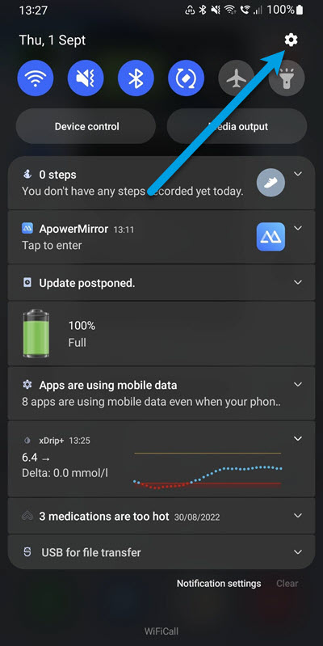
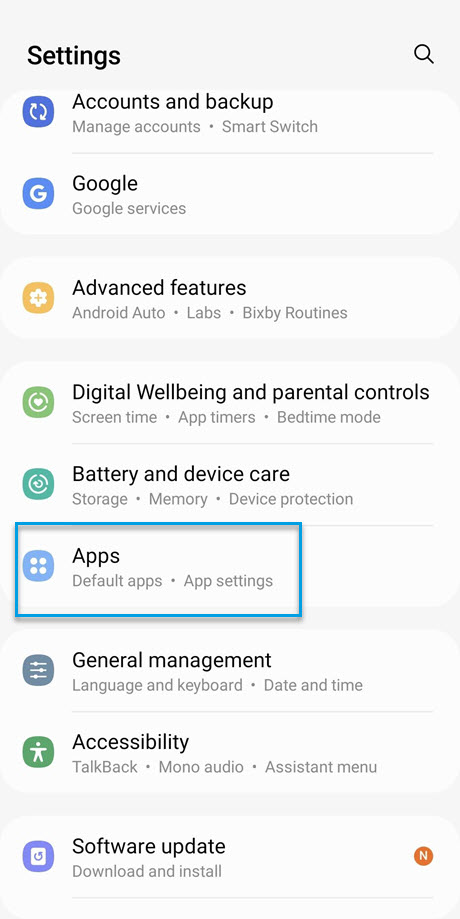
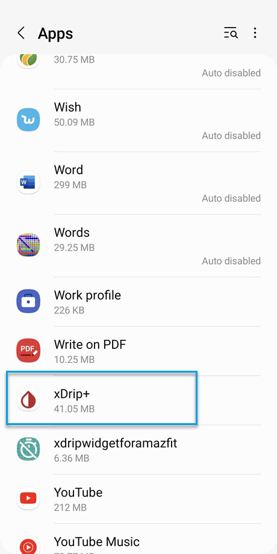
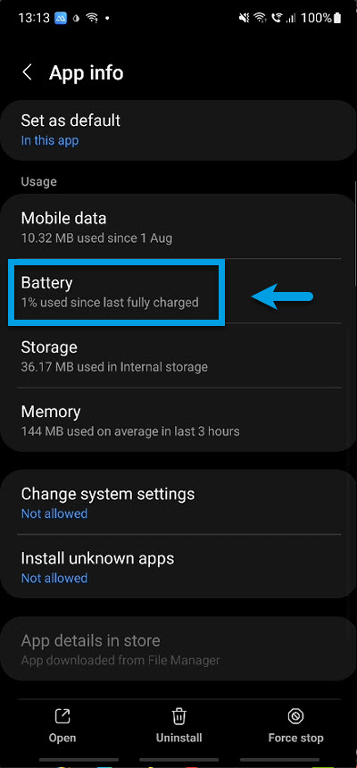
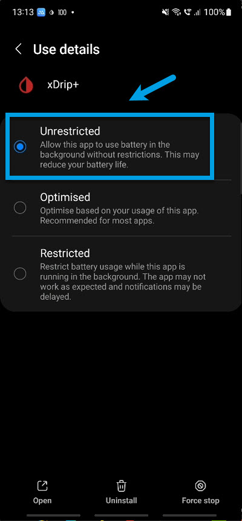

<!-- this is not on github server its local only and run my mkdocs server!
docs made by D.Galloway 2019- 2021-->
</a>
## Install xDrip  

This video installation process is a little old now and the video really needs to be updated, which I will do as soon as I get time to.

But for now, it’s still a good help for you to set up with xdrip+ onto your mobile. Just turn off the music if it’s not to your tastes :-) 
You do not need to have Nightscout installed for xdrip+ to work as mentioned in the video!
You can get your reading from your CGM direct from within xdrip+.
 

### **Install Xdrip+** 

<iframe id="video29564" width="860" height="615" src="https://www.youtube.com/embed/7Qwr4HrchTU" target="_blank" title="YouTube video player" frameborder="0" allow="accelerometer; autoplay; clipboard-write; encrypted-media; gyroscope; picture-in-picture" allowfullscreen></iframe>

 

After you have installed Your Apk and xdrip+ its time to install a few other options within xdrip. 

### **Authorize background activity** 
xDrip+ must have the right to be used in the background, and it must be white-listed for battery optimization. 
This is necessary for the correct functioning of xdrip+. 

It should ask you to allow these authorizations. If it doesn't or you need to look this up later, check it in your phone settings **Settings - Apps - xDrip+.** Consult your mobile documents as they will vary on Android software version and manufacturers. 
For me on a Samsung I swiped down and click on the gear icon to get to my settings. 
APPS/xDrip+/Battery 

 
    

 

 **And select Battery Unrestricted.**  

 

## 
**Making sure xDrip+ will not be put in to sleep mode and enabled permissions**
 
Make sure these settings are checked, but still make sure they are exactly like shown below. 
Every time your Mobile updates or you re-install, check again: disable and enable checkboxes that should be enabled to enforce the settings. 
Go to 
**Other misc options** 
**/ Settings / Less Common Settings / Other misc options**
  

And make sure these are selected! 

  

## **Enable location & other XDRIP+ Permissions** 

From Android versions <a href="https://en.wikipedia.org/wiki/Android_version_history#Android_6.0_Marshmallow" target="_blank" title="Android version 6 Marshmallow">(6 Marshmallow (and above),</a> location is required to allow Bluetooth Low Energy connection. 
If you will be using xDrip+ with a Bluetooth sensor or bridge you must enable location and allow xDrip+ to access it. See your mobiles instructions as it will depend on Android version and manufacturer in my case I’m using a Samsung Note10+
See My video on all the permissions I have allowed Xdrip+ too have on my mobile.

<iframe id="video294" width="860" height="615" src="https://www.youtube.com/embed/yHv86lZ2s58" title="YouTube video player" frameborder="0" allow="accelerometer; autoplay; clipboard-write; encrypted-media; gyroscope; picture-in-picture" allowfullscreen></iframe>  

## Next:see
### <a href=" https://atlas-night-out.github.io/my-project/user-guide/xdrip/xdrip%20-%20datasource/" target="_blank" title="Adding your Data Source">Adding your Data Source</a>   

<!--  
  ******************************************************************************************************************
  mkdocs.yml    # The configuration file.
    docs/
    index.md  # The documentation homepage.
       ...       # Other markdown pages, images and other files.
		
		*************************************************************************
		center text**
		## 
Now Do  
 
		
		*************************************************************
		
		
		
		
		
adding 	Yellow Hightligher!!!!!!!!	with bold too
**Marked text**

	

Adding a image with link
 

Adding Video

<iframe width="850" height="415" src="https://www.youtube.com/embed/MFsbm45b6YY" title="YouTube video player" frameborder="0" allow="accelerometer; autoplay; clipboard-write; encrypted-media; gyroscope; picture-in-picture" allowfullscreen></iframe>

Adding an embeded video
<iframe id="video3" width="560" height="315" src="https://www.youtube.com/embed/o7-T2IrDJ_A" title="YouTube video player" frameborder="0" allow="accelerometer; autoplay; clipboard-write; encrypted-media; gyroscope; picture-in-picture" allowfullscreen></iframe>

Note
**Note:** a note is something that needs to be mentioned but is apart from the context.

List
This is a regular paragraph.

Paragraph:

1. **Now Open another tab**  to make a Mongodb Atlas** Account: <a href="https://www.mongodb.com/cloud/atlas" target="_blank" title="Click Start Free">See Here</a> 
  and **click** Start Free
 
   2. Sub item two
   3. Sub item three
2. Item two

font size

link
<a href=" https://github.com/" target="_blank" title="First create a user account by going to">Click Here</a>

Table
| Syntax | Description |
| ----------- | ----------- |
| Header | Title |
| Paragraph | Text |

Video in a box border!

<table width="1166" border="1" style="border-color: #000000; background-color: #ffffff;" cellpadding="1" cellspacing="1" height="98">
<tbody>
<tr style="height: 16px;">
<td style="width: 1158px; border-color: #000000; background-color: #5B9BD5;" fff="">video Instructions,</td>
</tr>
<tr style="height: 56.4063px;">
<td style="width: 1158px; border-color: #000000;">
 <iframe id="video3" width="860" height="515" src="https://www.youtube.com/embed/6o3AdkQBVog" title="YouTube video player" frameborder="0" allow="accelerometer; autoplay; clipboard-write; encrypted-media; gyroscope; picture-in-picture" allowfullscreen></iframe>  </td>
</tr>
</tbody>
</table>
*****************************************************
Warning Note<table width="1266" border="1" style="border-color: #000000; background-color: #ffffff;" cellpadding="1" cellspacing="1" height="98">
<tbody>
<tr style="height: 16px;">
<td style="width: 1158px; border-color: #000000; background-color: #FF0000;" fff=""><strong>Warning!</strong></td>
</tr>
<tr style="height: 56.4063px;">
<td style="width: 1158px; border-color: #000000;"> 1: Some new features, updates, or bug fixes may require that you clear your browser cache before you will see the changes taken effect  2: If you get no errors and no readings after a while see about doing a <a href="http://127.0.0.1:8000/user-guide/Redeploying%20your%20repository/" target="_blank" title="Redeploying your repository link">Redeploying your repository</a> </td>
</tr>
</tbody>
</table>

-->

